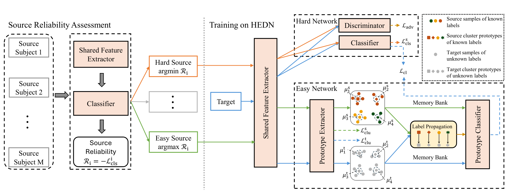

# HEDN  
[English](./README.md) | [简体中文](./README_zh.md)

## 概述

我们提出了一种新颖的**Hard-Easy Dual Network (HEDN)** 框架，用于跨被试的基于脑电（EEG）的情绪识别。



---

## 项目结构

```bash
├── hedn.yaml               # 实验配置与超参数
├── config.py              # 核心配置管理
├── requirements.txt       # Python 依赖库
│
├── data_utils/            # 数据预处理与dataloaders工具
├── datasets/              # 数据集加载与组织
│
├── models/                # 模型架构定义
├── loss_funcs/            # 论文中使用的损失函数
├── trainers/              # 训练逻辑与优化流程
├── utils/                 # 通用工具函数
│
├── cross_subject.py       # 跨被试实验主入口
├── cross_dataset.py       # 跨数据集实验主入口
│
└── get_model_utils.py     # 模型与训练器初始化辅助函数
```

---

## 数据集

我们在以下三个公开基准数据集上评估 HEDN：

- **[SEED](https://bcmi.sjtu.edu.cn/~seed/index.html)**  
  15 名被试 × 3 个会话 × 15 段诱发情绪的影片 (positive, neutral, negative)

- **[SEED-IV](https://bcmi.sjtu.edu.cn/~seed/index.html)**  
  SEED 的扩展版本，包含 4 类情绪：happy, sad, fear, neutral

- **[DEAP](http://www.eecs.qmul.ac.uk/mmv/datasets/deap/)**  
  32 名被试 × 40 段 60 秒音乐视频，带有valence、arousal等维度评分

> **⚠️ 注意**：由于数据使用协议限制，我们无法重新分发这些数据集。请前往官方网站申请访问权限。

---

## 实验平台

所有实验均在以下环境中运行：

- **操作系统**：Windows 11  
- **CPU**：Intel Core i7-14700  
- **内存**：32 GB  
- **GPU**：NVIDIA RTX 5070 Ti（CUDA 11.8）  
- **依赖库**：详见 `requirements.txt` 中的具体版本

该配置确保了实验的可复现性与深度神经网络训练的效率。使用相似硬件的用户应能获得一致的性能表现。

---

## 环境依赖

请确保已安装以下软件：

- Python ≥ 3.12  
- PyTorch ≥ 2.8.0  
- scikit-learn  
- NumPy  

通过以下命令安装全部依赖：

```bash
pip install -r requirements.txt
```

---

## 使用方法

### 1. 数据准备

请从官方渠道下载 SEED、SEED-IV 和 DEAP 数据集，并在 `hedn.yaml` 中配置本地路径：

```yaml
# ...other parameters...
seed4_path: "/path/to/your/SEED-IV/eeg_raw_data"
seed3_path: "/path/to/your/SEED/Preprocessed_EEG"
deap_path: "/path/to/your/DEAP/"
# ...other parameters...
```

### 2. 运行实验

#### 跨被试实验

执行 `cross_subject.py` 并传入相应参数：

```bash
python cross_subject.py --dataset_name <dataset> [--session <int>] [--emotion <str>]
```

- `<数据集>`：`seed3`、`seed4` 或 `deap`  
- `--session`：SEED/SEED-IV 必需（1、2 或 3）  
- `--emotion`：DEAP 必需（`valence` 或 `arousal`）

**示例**：
```bash
# 运行 SEED 第 1 个会话
python cross_subject.py --dataset_name seed3 --session 1

# 运行 DEAP 效价任务
python cross_subject.py --dataset_name deap --emotion valence
```

#### 跨数据集实验

当前支持 `seed3 → seed4` 与 `seed4 → seed3` 的迁移：

```bash
python cross_dataset.py
```

#### 一键运行全部实验

使用以下脚本复现论文全部结果：

```bash
python run.py
```
